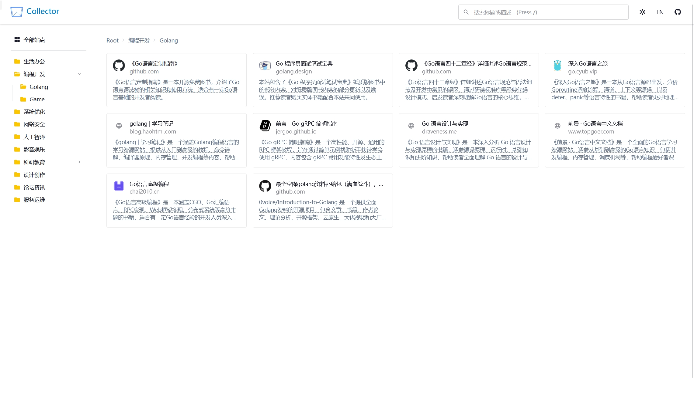
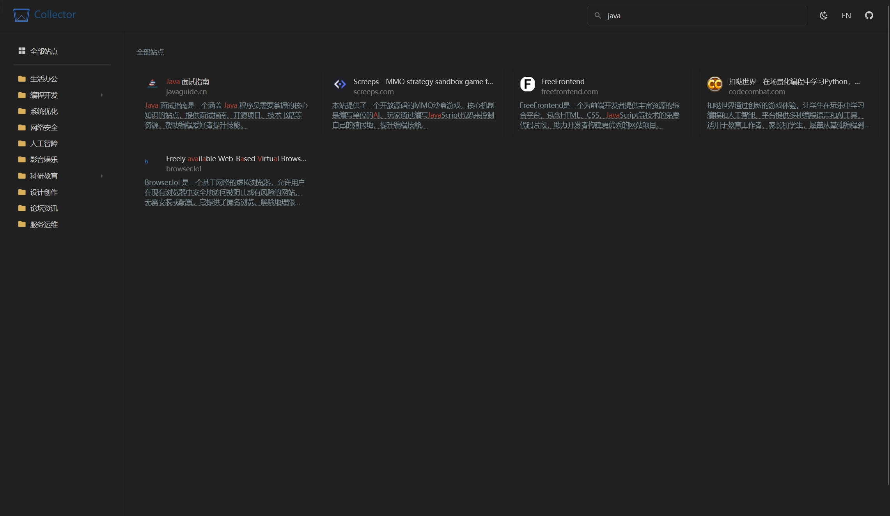

# Collector

<div align="center">


**一个现代化、简约设计的网址导航页面**

[在线预览](https://wefantasy.github.io/collector/) · [报告问题](https://github.com/wefantasy/collector/issues) · [功能建议](https://github.com/wefantasy/collector/issues)

</div>

---

## ✨ 功能特性

- 📁 **多级分类管理** - 支持无限层级的文件夹嵌套，灵活组织网站收藏
- 🔍 **模糊搜索** - 基于 Fuse.js 的智能搜索，支持标题、描述关键字高亮
- 🎨 **主题切换** - 支持亮色/暗色主题，自动保存用户偏好
- 🌐 **国际化** - 支持中文/英文界面切换
- 📱 **响应式设计** - 完美适配桌面端和移动端
- ⌨️ **快捷键支持** - 按 `/` 快速聚焦搜索框

## 🖼️ 截图预览

| 亮色主题 | 暗色主题 |
|---------|---------|
|  |  |

## 🛠️ 技术栈

| 技术 | 说明 |
|------|------|
| [SvelteKit](https://kit.svelte.dev/) | 全栈 Web 框架 |
| [TailwindCSS](https://tailwindcss.com/) | 原子化 CSS 框架 |
| [DaisyUI](https://daisyui.com/) | TailwindCSS 组件库 |
| [Iconify](https://iconify.design/) | 统一图标解决方案 |
| [Fuse.js](https://fusejs.io/) | 轻量级模糊搜索库 |

## ▶️ 快速开始

### 使用方法

1. [点此 Fork](https://github.com/wefantasy/collector/fork) 这个项目到你的 GitHub 账户
2. 在你 Fork 的仓库下点击 `Actions` -> `I understand my workflows, go ahead and enable them` 启动流水线
3. 点击 `Actions` -> `Build and Deploy` -> `Run workflow`，选择 `main` 分支并运行流水线，**等待运行完成**
4. 在 `Settings` -> `Pages` -> `Branch` 中选择 `gh-pages` 分支并 `Save`
5. 修改 `src/lib/data/sites.json` 文件并push到 `main` 分支
6. 访问你的站点：`https://your-github-username.github.io/collector/`

### 修改导航数据

编辑 `src/lib/data/sites.json` 文件：

```json
[
  {
    "title": "分类名称",
    "type": "folder",
    "children": [
      {
        "title": "网站标题",
        "url": "https://example.com",
        "icon": "",
        "description": "网站描述"
      }
    ]
  }
]
```

### 添加新主题

编辑 `tailwind.config.js`：

```javascript
daisyui: {
  themes: ['light', 'dark', 'cupcake', 'corporate'],
}
```


## 📦 开发环境准备

### 环境要求

- Node.js 18+
- npm 或 pnpm

### 安装依赖

```bash
pnpm install
```

### 开发模式

```bash
pnpm run dev
```

访问 http://localhost:5173 查看效果

### 构建生产版本

```bash
pnpm run build
```

构建产物将输出到 `build` 目录

### 预览生产版本

```bash
pnpm run preview
```

## 📁 项目结构

```
nav-collector/
├── src/
│   ├── lib/
│   │   ├── components/       # Svelte 组件
│   │   │   ├── Navbar.svelte
│   │   │   ├── Sidebar.svelte
│   │   │   ├── ContentArea.svelte
│   │   │   ├── SiteCard.svelte
│   │   │   ├── FolderCard.svelte
│   │   │   ├── Footer.svelte
│   │   │   ├── MobileDrawer.svelte
│   │   │   └── BackToTop.svelte
│   │   ├── data/
│   │   │   └── sites.json    # 导航数据
│   │   ├── stores.js         # 状态管理
│   │   └── i18n.js           # 国际化配置
│   ├── routes/
│   │   ├── +layout.svelte    # 全局布局
│   │   ├── +layout.js        # 预渲染配置
│   │   └── +page.svelte      # 首页
│   ├── app.css               # 全局样式
│   └── app.html              # HTML 模板
├── svelte.config.js          # SvelteKit 配置
├── tailwind.config.js        # TailwindCSS 配置
├── postcss.config.js         # PostCSS 配置
└── vite.config.js            # Vite 配置
```

## ⌨️ 快捷键

| 快捷键 | 功能 |
|--------|------|
| `/` | 聚焦搜索框 |

## 🤝 贡献指南

1. Fork 本仓库
2. 创建特性分支 (`git checkout -b feature/AmazingFeature`)
3. 提交更改 (`git commit -m 'Add some AmazingFeature'`)
4. 推送到分支 (`git push origin feature/AmazingFeature`)
5. 提交 Pull Request

## 📄 许可证

本项目基于 [MIT](LICENSE) 许可证开源。

## 🙏 致谢

- [SvelteKit](https://kit.svelte.dev/)
- [TailwindCSS](https://tailwindcss.com/)
- [DaisyUI](https://daisyui.com/)
- [Iconify](https://iconify.design/)
- [Fuse.js](https://fusejs.io/)

---

<div align="center">

**如果这个项目对你有帮助，请给一个 ⭐ Star 支持一下！**

</div>
